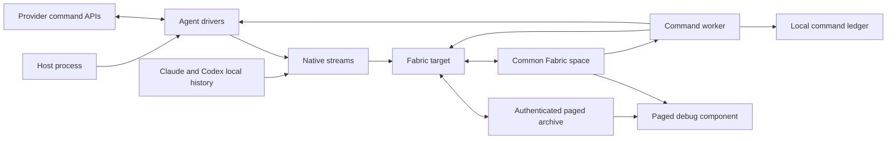

# Agent connector architecture

The agent connector has two data paths. Native collection reads local Claude and
Codex history into a bounded, paged archive and publishes its catalog in Common
Fabric. The command path reads commands from Common Fabric, invokes the
appropriate provider SDK or protocol, and writes receipts back to Common Fabric.

The command-line host uses the native v2 path described here. The eager v1
collection and stable session graph APIs remain available to library callers;
their contracts are in [Interfaces and protocols](interfaces.md).

## Components

### Host process

The host owns process-level policy. It selects enabled sources, provides their
configuration, creates drivers, and controls their lifecycle. It also creates
the Common Fabric runtime, chooses the destination space DID, and supplies the
owner DID for the person whose local agents are being synchronized.

The host decides when to run a full collection. It decides whether to subscribe
to commands, poll commands, or do both. It also supplies health details and the
location of the local command ledger.

The connector never opens a Common Fabric connection by itself. It receives an
initialized runtime, destination space, and owner DID through
`AgentFabricConnection`.

### Agent drivers

An `AgentDriver` exposes eager session inventory and reads, prompts,
cancellation, renaming, mode selection, and provider configuration changes. It
can also implement the pull-based `streamSessions()` native collection boundary.
Each driver advertises its supported provider operations.

Provider-specific code stays behind this interface:

- `ClaudeAgentSdkDriver` streams local project and subagent transcripts for
  collection and calls the Claude SDK for commands and eager library reads.
- `CodexAppServerDriver` streams local rollouts and database values for
  collection and uses App Server JSON-RPC for commands and eager library reads.
- `AcpDriver` provides eager reads and commands through the ACP SDK. It does not
  implement native streaming, so the native publisher rejects ACP collection.

V1 snapshots preserve provider API objects in `SessionSummary.raw` and
`NativeSessionSnapshot.events`. V2 captures exact native bytes with provenance
and keeps only bounded metadata and normalized previews in JavaScript values.
These representations have different semantics; the
[archive contract](bounded-archive.md#stored-representation) describes that
boundary.

### Native collection

`streamSessions()` builds a disk-backed inventory and yields one session at a
time. Each session yields fixed-size byte fragments and bounded preview records.
The parser handles JSON strings incrementally and stores deep nesting state on
scratch disk. SQLite sources remain in stable read transactions and use
incremental reads for large values. Native file identity, extent, and digests
detect changes during capture.

The publisher awaits each archive write before pulling more source data. It
stores native bytes, normalized preview pages, and provenance digests. Session
records hold bounded summaries and counts. Neither inventory nor publication
assembles every session or a complete transcript in memory.

`GitContextResolver` observes repository metadata from session directories and
discovered checkouts. Each publication shares bounded caches of recent directory
and root observations. Complete observations, including head, sanitized remotes,
and observation time, occupy Git archive pages. Session and checkout records
retain bounded previews and page ranges. A failed session Git lookup preserves
the previous complete Git range while publishing current native bytes and an
explicit failure flag.

### Fabric target

`AgentFabricTarget.connectArchive()` validates the backend's protocol and hard
limits before synchronizing connector cells. The native path uses an
owner-scoped catalog cell plus the shared health, command, and receipt cells. It
leaves old v1 session graph and index roots frozen.

`publishStreams()` serializes the full scan or targeted refresh. It stages
immutable session records and pages, publishes a complete archive generation,
then updates the bounded Fabric catalog pointer. Readers pin a generation while
requesting catalog rows, page directories, and byte pages. Pruning preserves
data required by those pins. Restart discards abandoned staging.

A failed session capture retains the previous complete record and marks it
partial. An incomplete source inventory retains unseen prior sessions. A
complete inventory can remove missing sessions. A targeted refresh retains
unrelated sessions and does not claim a complete inventory.

The first v2 catalog requires a complete full scan. Initial partial and targeted
scans cannot initialize it. Migration reads native sources without hydrating or
rewriting the v1 roots. See [Bounded native archive](bounded-archive.md) for
failure, migration, and server configuration details.

For v1 library callers, `collectSource()` and `prepareSession()` still assemble
provider snapshots and event chunks. `AgentFabricTarget.open()` and `publish()`
write the existing deterministic session, manifest, and index cells. Their
observation sequences protect eager reads that finish out of order. These APIs
do not provide the native path's memory bounds.

### Command worker and ledger

`CommandWorker` validates command values and deduplicates command IDs. It
persists and publishes an in-flight receipt before it invokes a provider. This
claim prevents a process restart from silently executing the same command again.
Before making that claim, it reads the deterministic receipt cell. A receipt
from an earlier host prevents sequential failover from repeating the provider
operation when the new host has no local ledger history.

Commands for one session run in order. Different sessions can run concurrently.
A cancellation admitted after a prompt waits until the driver reports that its
cancellation method can address the prompt. It then bypasses the remaining
per-session queue. Claude reports this milestone while session metadata lookup
is pending. ACP and Codex report it after their provider operation has started.

Prompt execution gives the driver a callback that refreshes the affected
session. A driver calls and awaits it after the provider operation has started
and cancellation can address it. The worker refreshes the session again after
every terminal outcome. Drivers whose session reads report active state can
therefore publish activity that exists only while a connector-owned prompt is
running.

`CommandLedger` stores the latest receipt for every command ID in a local JSON
file. It also records which receipts have not completed publication. On restart,
`recoverUnpublishedReceipts()` changes any in-flight receipt to unknown and
republishes it together with terminal receipts left pending by an earlier
publication failure. The connector cannot infer whether a provider completed an
operation after the process lost contact with it.

After a successful provider command, the worker asks every target to refresh the
affected session. It does this even when terminal receipt publication fails. The
ledger retains the terminal receipt for a later publication attempt.

## State ownership

The provider owns native sessions and native event history. The connector reads
that state and invokes supported provider operations.

The archive server owns immutable native pages, bounded record metadata, and
generation and pin state. It binds access to the owner and connector writer
through authenticated Memory sessions and trusted Common Fabric labels.

Common Fabric owns the published catalog pointer, command queue, health value,
and command receipts. The individual command receipt is the shared command claim
across sequential hosts. Fabric causes determine these cells' durable
identities.

The local ledger records command execution claims across restarts of one host.
The Fabric receipt protects sequential handoff to a host without that local
state. The ledger is not a second source of session data.

The host owns source configuration, scheduling, health policy, process locks,
Common Fabric credentials, and deployment.

## Lifecycle

A native host performs these steps:

1. Build one `AgentSourceConfig` for every enabled source.
2. Initialize the runtime, resolve the space and owner, and call
   `AgentFabricTarget.connectArchive()`. Unsupported archive capabilities fail
   before connector cells are synchronized or drivers start.
3. Acquire process locks, claim the owner-scoped roots, configure private native
   scratch storage, and open `CommandLedger`.
4. Create and start drivers, create `CommandWorker`, and call
   `recoverUnpublishedReceipts()`.
5. Call `publishStreams()` for the initial full collection.
6. Deploy the debug view, bind its protected command queue, and subscribe or
   poll for commands when command admission is enabled.
7. Publish host-defined health once startup ownership transfers to the host.

Shutdown first stops command admission. The host calls `CommandWorker.drain()`
while drivers and Fabric targets are still usable, because admitted provider
work and terminal receipt publication may still be active. It calls
`recoverUnpublishedReceipts()` once more to flush receipts left pending by a
failed command task, then stops the drivers. The Common Fabric runtime can be
disconnected after those operations finish.

## Concurrency and failure behavior

Native collection and targeted refresh use one serial queue per target. Their
file reads and archive writes run outside the Fabric mutation queue. The final
catalog switch joins that mutation queue with health and receipt publication.
Commands can publish their receipts while a native scan is reading files. The
catalog continues to identify the last complete generation during the scan. The
v1 eager path uses observation sequences to preserve the order of reads
performed before publication enters the mutation queue.

The command ledger also serializes its read, update, and durable write sequence.
Unix writes synchronize a temporary file, rename it, and synchronize the parent
directory. Windows alternates between two synchronized generation files so an
interrupted write does not destroy the newest valid state. The ledger accepts
only private state directories and files owned by the current user on systems
with Unix permissions. A failed ledger mutation does not poison later mutations.

Archive operations and Fabric graph writes report failures to the caller. The
connector does not retry them. A failed native publication leaves the previous
catalog available to readers.

The Codex and ACP transports keep protocol calls pending until the provider
answers, the host aborts startup, or the provider process exits. The Claude SDK
driver follows the SDK's async query lifetime. The package does not impose
elapsed-time limits on provider work.
